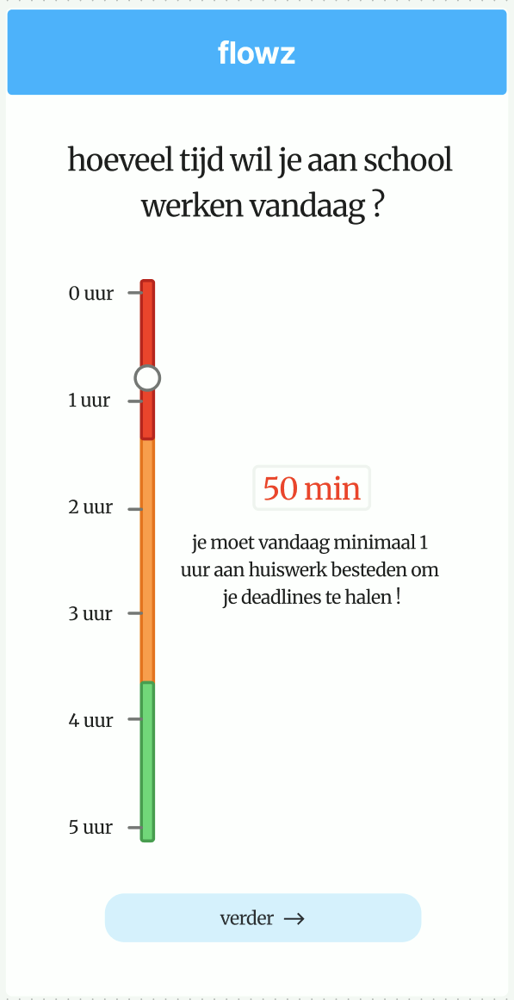

← | [02.3 Shortlist Vandaag →](../02.3-shortlist-vandaag/02.3-shortlist-vandaag.md)



← | [02.3 Shortlist Vandaag →](../02.3-shortlist-vandaag/02.3-shortlist-vandaag.md)

---

# 02.2 Tijdkeuze

## Page Metadata

| Property | Value |
|----------|-------|
| Scenario | 02 Check-in Flow |
| Page Number | 02.2 |
| Platform | Mobile web |
| Page Type | Form / Interactive |
| Viewport | Portrait, full-height scroll |
| Interaction | Vertical drag slider |
| Visibility | Private (authenticated) |

---

## Overview

| Property | Value |
|----------|-------|
| Purpose | Evelien kiest hoeveel studietijd ze vandaag beschikbaar heeft; het systeem visualiseert direct de consequentie via kleurzones |
| User Situation | Net klaar met energiecheck (02.1); staat aan het begin van haar studiedag en bepaalt haar intentie |
| Success Criteria | Slider thumb op een waarde zetten en op "verder" drukken; check-in doorstroomt zonder blokkade naar de shortlist |
| Entry Points | 02.1 Energie Check-in (via "verder" knop) |
| Exit Points | 02.3 Shortlist Vandaag (via "verder →" knop, altijd beschikbaar ongeacht zone) |

---

## Reference Materials

- `design-artifacts/A-Product-Brief/RFC-003-tijdplanning-dynamic-pacing-slider.md` — product brief met zonelogica
- `design-artifacts/B-Trigger-Map/personas/02-Evelien-de-Scholiere.md` — persona: rust en autonomie zijn kernwaarden
- Schets: `sketches/02.2-tijdkeuze-concept.png`

---

## Layout Structure

```
+---------------------------+
|   App Header (flowz)      |  lichtblauw, "flowz" bold wit gecentreerd
+---------------------------+
|                           |
|  Vraag (H1, 2 regels,     |  grote bold vraagstelling
|  gecentreerd)             |
|                           |
+--------+------------------+
|  Schaal|  Slider track    |  twee-kolom zone:
|  links |  verticaal       |  links: tijdlabels (0–5 uur)
|        |  + thumb         |  midden: gekleurde verticale balk
|        |                  |
|        |  [tijdsweergave] |  rechts van thumb: grote gekleurde tijd-tekst
|        |  [feedback tekst]|  rechts, onder tijdsweergave
|        |                  |
+--------+------------------+
|                           |
|  [ verder → ]             |  volle breedte, lichtblauw, afgerond
|                           |
+---------------------------+
```

---

## Spacing

| Token | Direction | Type | Size | Reason |
|-------|-----------|------|------|--------|
| `02.2-tijdkeuze-v-space-xl` | Vertical | space | xl | tussen app header en vraag-heading |
| `02.2-tijdkeuze-v-space-lg` | Vertical | space | lg | tussen vraag en sliderzone |
| `02.2-tijdkeuze-v-space-xl` | Vertical | space | xl | tussen sliderzone en verder-knop |
| `02.2-tijdkeuze-h-pad-md` | Horizontal | padding | md | zijmarges van de gehele pagina |

---

## Typography

| Element | Semantic | Size | Weight | Typeface |
|---------|----------|------|--------|----------|
| App header label | — | sm | 700 Bold | Karla_700Bold |
| Vraag-heading | H1 | 2xl | 700 Bold | Karla_700Bold |
| Tijdsweergave (dynamisch) | — | 3xl | 700 Bold | Karla_700Bold |
| Feedback tekst | Body | md | 400 Regular | Karla_400Regular |
| Schaal-labels (0–5 uur) | — | sm | 400 Regular | Karla_400Regular |

---

## Page Sections

### Section: App Header

| Object ID | Component | EN Content | NL Content | Behavior |
|-----------|-----------|-----------|-----------|---------|
| `02.2-header` | Standaard app header (wit, `border-b border-gray-100`) | — | — | Identiek aan alle andere app-schermen: hamburger links, "Flowz" bold gecentreerd, profielicoon rechts |

---

### Section: Vraag

| Object ID | Component | EN Content | NL Content | Behavior |
|-----------|-----------|-----------|-----------|---------|
| `02.2-question-heading` | H1 heading, gecentreerd, 2 regels | How much time do you want to spend on school today? | hoeveel tijd wil je aan school werken vandaag? | Statisch |

---

### Section: Slider

| Object ID | Component | EN Content | NL Content | Behavior |
|-----------|-----------|-----------|-----------|---------|
| `02.2-slider-scale` | Tijdschaal, verticaal links naast slider | 0 hr · 1 hr · 2 hr · 3 hr · 4 hr · 5 hr | 0 uur · 1 uur · 2 uur · 3 uur · 4 uur · 5 uur | Statisch; uur-intervallen met tick-marks |
| `02.2-slider-track` | Verticale slider track | — | — | Track-achtergrond in drie segmenten (Rood boven / Oranje midden / Groen onder); maximale schaalwaarde = **5 uur (hard, niet instelbaar)**; segmentgrootte bepaald door `@/lib/planning` engine op basis van huidige taken + deadlines; thumb = witte cirkel, start op macro-waarde van vandaag |
| `02.2-slider-thumb` | Draggable thumb (witte cirkel) | — | — | Verticaal sleepbaar; thumb-positie = gekozen studietijd; beweegt nooit automatisch; waarde opgeslagen in `sessionStore.selectedMinutes` |
| `02.2-time-display` | Grote tekst, zweeft rechts van thumb | 50 min / 1 hr 30 min | 50 min / 1 uur 30 min | Kleur = huidige zonecolor (rood/oranje/groen); positie scrollt mee met thumb; toont minuten onder 60 min als "X min", daarboven als "X uur Y min" |
| `02.2-feedback-text` | Body tekst, rechts van slider onder tijdsweergave, gecentreerd | (zie Page States) | (zie Page States) | Wisselt per zone; animatie max 100ms bij zone-overgang |

---

### Section: Footer

| Object ID | Component | EN Content | NL Content | Behavior |
|-----------|-----------|-----------|-----------|---------|
| `02.2-cta-verder` | Full-width pill knop, lichtblauw | continue → | verder → | Altijd actief — nooit disabled, ook niet in rode zone; navigeert naar 02.3 Shortlist; slaat `sessionStore.selectedMinutes` op vóór navigatie |

---

## Page States

| State | Wanneer actief | Tijdsweergave kleur | Feedback tekst (NL) | Feedback tekst (EN) |
|-------|---------------|--------------------|--------------------|-------------------|
| **Rode zone** | Geselecteerde tijd < min. vereist voor harde deadlines vandaag | Rood (`text-red-500`) | "je moet vandaag minimaal X uur aan huiswerk besteden om je deadlines te halen !" | "you need to spend at least X hours on homework today to meet your deadlines!" |
| **Oranje zone** | Min. vereist ≤ geselecteerde tijd < luxe-drempel | Oranje (`text-orange-400`) | "je ligt perfect op schema voor je taken." | "you're perfectly on track for your tasks." |
| **Groene zone** | Geselecteerde tijd ≥ luxe-drempel | Groen (`text-green-500`) | "je werkt nu alvast vooruit. Je bouwt een buffer op voor je taken." | "you're working ahead. You're building a buffer for your tasks." |
| **Geen deadlines** | Geen taken met harde deadlines in de komende dagen | Groen (direct) | "je hebt vandaag geen dringende deadlines. Geniet van de ruimte!" | "you have no urgent deadlines today. Enjoy the breathing room!" |

**Zoneberekening (runtime, delegated to `@/lib/planning`):**
- `threshold_red` = som van minimaal vereiste sessieduren voor harde deadlines die vandaag gedekt moeten worden
- `threshold_green` = threshold_red × 1.25 (comfortabele buffer, te verfijnen in implementatie)
- Meso-overrides (vakantie/toetsweek) worden meegewogen: engine kijkt X dagen vooruit en past drempels proactief aan

---

## Open Questions

- ~~Wat is de maximale sliderwaarde?~~ → **Besloten: 5 uur, hard maximum, niet instelbaar.**
- ~~Groene zone "morgen" benoemen?~~ → **Besloten: generieke tekst, geen dag-specifieke referentie.**

---

## Checklist

- [x] Navigation links updated
- [x] Sketch added (tijdsslider.png)
- [x] All objects have NL + EN content
- [x] All Object IDs use correct prefix (`02.2-`)
- [x] Page States defined (4 states)
- [x] Spacing tokens defined

← | [02.3 Shortlist Vandaag →](../02.3-shortlist-vandaag/02.3-shortlist-vandaag.md)
