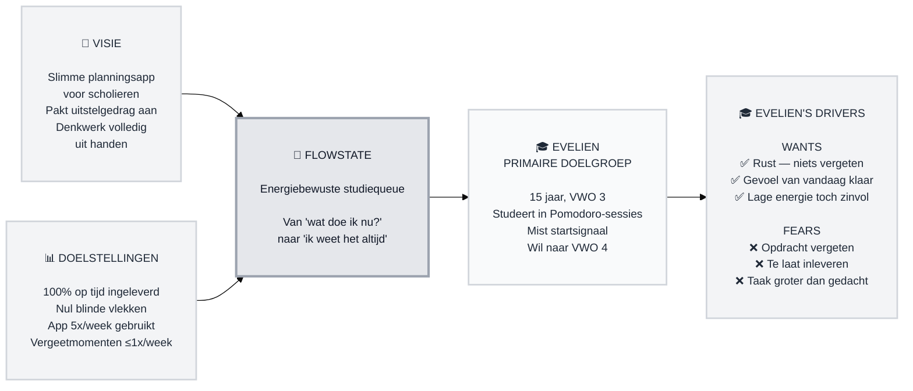

# Trigger Map — FlowState (EveliensTaakjesApp)

> Visueel overzicht dat bedrijfsdoelen verbindt met gebruikerspsychologie

**Aangemaakt:** 2026-05-23
**Auteur:** Evelien
**Methodologie:** Gebaseerd op Effect Mapping (Balic & Domingues, inUse), aangepast voor WDS framework

---

## Strategische Documenten

Dit is het visuele overzicht. Voor gedetailleerde documentatie, zie:

- **[01-Business-Goals.md](01-Business-Goals.md)** — Visie en SMART-doelstellingen
- **[personas/02-Evelien-de-Scholiere.md](personas/02-Evelien-de-Scholiere.md)** — Primaire persona met volledige drijvende krachten
- **[05-Key-Insights.md](05-Key-Insights.md)** — Strategische implicaties voor ontwerp en ontwikkeling

---

## Trigger Map Diagram

---

## Samenvatting

**Primaire doelgroep:** Evelien — VWO 3, 15 jaar

**Kerntransformatie:**
Van een scholier die op urgentie reageert en dingen vergeet → naar een scholier die altijd weet wat er is, nooit meer achterloopt, en aan het eind van de dag rust voelt.

**De Flywheel:**

1. 🎯 Evelien voert al haar taken in — nul blinde vlekken
2. ⚡ Dagelijkse energie-check-in → slimme shortlist van 3 taken
3. ✅ Ze werkt de shortlist af — gevoel van "vandaag klaar"
4. 🔔 Urgentie-escalatie zorgt dat niets te laat is
5. 😌 Rust: altijd weten dat niets vergeten is

---

## Gedetailleerde Documentatie

### 🎯 Bedrijfsstrategie

**[01-Business-Goals.md](01-Business-Goals.md)** — Volledige visie en SMART-doelstellingen

- **Visie:** Slimme planningsapp die het denkwerk volledig uit handen neemt door deadline, prioriteit, sessiespreiding en energie te combineren tot één concreet actieplan per sessie
- **Primair doel:** 100% van taken vóór deadline ingeleverd (binnen 2 weken zichtbaar)
- **Motor:** Dagelijks gebruik 5x/week → gewoontevorming → nul vergeetmomenten
- **Succescriteria:** Minder deadline-paniek, meer gevoel van controle

---

### 👤 Doelgroep

**[personas/02-Evelien-de-Scholiere.md](personas/02-Evelien-de-Scholiere.md)** — Primaire persona

- **Profiel:** Evelien, 15 jaar, VWO 3 — gemotiveerd maar loopt vast op de drempel vóór het studeren
- **Kernprobleem:** Geen startsignaal + geen voortgangsinzicht = te laat ontdekken dat het crisis is
- **Top wants:** Rust (niets vergeten), gevoel van "vandaag klaar", lage energie toch zinvol
- **Top fears:** Opdracht vergeten, te laat inleveren, 's avonds verrast worden door omvang taak

---

### 💡 Strategische Implicaties

**[05-Key-Insights.md](05-Key-Insights.md)** — Ontwerp- en ontwikkelimplicaties

- **Kern-inzicht:** Het probleem zit niet in studeren, maar in de cognitieve drempel ervóór
- **Ontwerpregel #1:** Elimineer keuzestress — beperkte shortlist, actief advies
- **Ontwerpregel #2:** Maak urgentie zichtbaar vóórdat het crisis wordt
- **Ontwerpregel #3:** Rust als eindtoestand — niet "klaar zijn" maar "niets vergeten"

---

## Hoe Dit Diagram Lezen

- **Links → Rechts:** Bedrijfsdoelen → Platform → Doelgroep → Drijvende krachten
- **Top → Bottom:** Hogere prioriteit bovenaan
- **✅ WANTS:** Wat de gebruiker wil bereiken
- **❌ FEARS:** Wat de gebruiker vreest of wil vermijden
- **Verbindingen:** Hoe bedrijfsdoelen via het platform inspelen op gebruikersmotivatie

---

_Gegenereerd met het Whiteport Design Studio framework_
_Trigger Mapping methodologie: Effect Mapping door Mijo Balic & Ingrid Domingues (inUse), uitgebreid met negatieve drijvende krachten_
